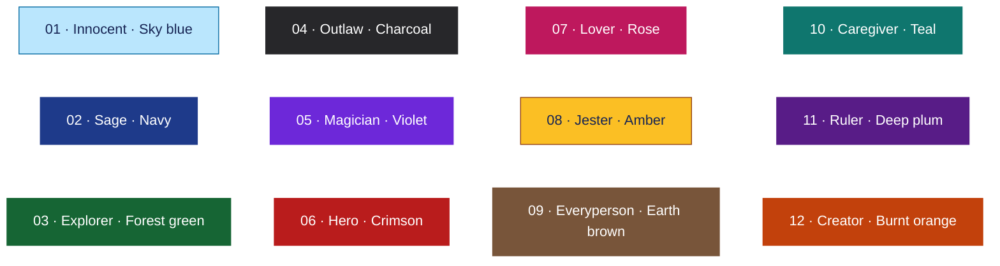

# The 12 Brand Archetypes

A brand archetype is a recognizable character pattern that helps give a brand a consistent personality. It connects what a brand promises with how it speaks, looks, and treats its customers. The familiar twelve-archetype branding framework comes from Margaret Mark and Carol S. Pearson's *The Hero and the Outlaw*. Pearson explains that archetype names vary with their application; for example, Everyperson is also called Regular Guy/Gal, and Rebel is often called Outlaw. [Framework overview](https://thebrandarchetypes.com/what-is-a-brand-archetype/) · [Pearson's explanation](https://carolspearson.com/about/the-pearson-12-archetype-system-human-development-and-evolution)

Use archetypes as a planning framework, not a rule that every customer or business must fit. A brand needs actions that support its personality: friendly language means little if getting help is frustrating.

## Color key

The colors below are **suggestions created for this guide**, not official archetype colors or universal psychological meanings. Names and numbers identify each archetype even when colors are difficult to distinguish. Hex codes specify exact colors for digital design.

GitHub renders this Mermaid diagram with colored boxes. If your Markdown preview does not support Mermaid, use the table below as the color reference.

| # | Archetype | Central motivation | Suggested color | Hex code |
|---|---|---|---|---|
| 1 | Innocent | Optimism and simplicity | Sky blue | `#BAE6FD` |
| 2 | Sage | Knowledge and understanding | Navy | `#1E3A8A` |
| 3 | Explorer | Freedom and discovery | Forest green | `#166534` |
| 4 | Outlaw / Rebel | Liberation and change | Charcoal | `#27272A` |
| 5 | Magician | Transformation and possibility | Violet | `#6D28D9` |
| 6 | Hero | Courage and achievement | Crimson | `#B91C1C` |
| 7 | Lover | Intimacy and connection | Rose | `#BE185D` |
| 8 | Jester | Enjoyment and play | Amber | `#FBBF24` |
| 9 | Everyperson | Belonging and acceptance | Earth brown | `#78553A` |
| 10 | Caregiver | Service and protection | Teal | `#0F766E` |
| 11 | Ruler | Order and control | Deep plum | `#581C87` |
| 12 | Creator | Originality and expression | Burnt orange | `#C2410C` |

The motivations summarize the [twelve-archetype framework](https://thebrandarchetypes.com/what-is-a-brand-archetype/). All business scenarios, sample messages, palettes, and implementation advice below are original teaching examples, not claims about existing companies.

## 1. Innocent — Sky blue `#BAE6FD`

**Personality:** Optimistic, sincere, and reassuring. The Innocent seeks goodness and simplicity and fears losing that sense of safety.

**How to build this brand:** Make everyday decisions feel manageable. Explain what the product does in straightforward terms and remove unnecessary choices. Its promise could be a calmer, easier routine, supported by transparent information rather than complicated claims.

- **Voice:** Warm, clear, and hopeful. Avoid technical language when an everyday word works.
- **Visual direction:** Use sky blue with white space, simple shapes, and bright photographs. For this guide, the light palette suggests openness. Put dark text on the pale background.
- **Hypothetical example:** A soap shop lists ingredients plainly and organizes products by scent. Sample message: “A simple start to your day.”
- **Strength and pitfall:** Simplicity can make the experience approachable, but excessive cheerfulness can feel dismissive when a customer has a serious problem.
- **Website application:** Offer a short product comparison and visible delivery information. Let the customer understand the purchase without searching through fine print.

## 2. Sage — Navy `#1E3A8A`

**Personality:** Thoughtful, analytical, and curious. The Sage seeks truth and understanding and fears being misled.

**How to build this brand:** Help customers make informed decisions. Explain how conclusions were reached, define unfamiliar terms, and show the limits of available evidence. Being useful matters more than sounding impressive.

- **Voice:** Precise, patient, and explanatory. Support factual claims with accessible sources.
- **Visual direction:** Use navy, generous margins, readable typography, and clearly labeled charts. Navy provides a restrained accent for an information-focused layout.
- **Hypothetical example:** A laptop comparison service explains how battery life was tested. Sample message: “Understand the differences before you choose.”
- **Strength and pitfall:** Detailed explanations can earn confidence, but too much information can overwhelm beginners or delay a decision.
- **Website application:** Provide a brief answer first, followed by expandable explanations and source links. Make the depth optional.

## 3. Explorer — Forest green `#166534`

**Personality:** Independent, adventurous, and curious. The Explorer seeks freedom and discovery and fears confinement.

**How to build this brand:** Give people tools to follow their interests and choose their own route. The experience should encourage discovery without implying that everyone wants the same kind of adventure.

- **Voice:** Inviting and energetic, with language about possibilities, routes, and discovery.
- **Visual direction:** Pair forest green with sand tones, open compositions, maps, and landscape photography. Green connects this particular design concept to outdoor settings.
- **Hypothetical example:** A hiking planner lets users select distance, terrain, and difficulty. Sample message: “Find a trail that feels like yours.”
- **Strength and pitfall:** Freedom can feel exciting, but presenting only extreme adventures may make new participants feel excluded.
- **Website application:** Offer beginner routes and flexible filters. Explain preparation clearly so visitors can make informed choices.

## 4. Outlaw / Rebel — Charcoal `#27272A`

**Personality:** Defiant, unconventional, and disruptive. The Outlaw challenges restrictions and fears powerlessness or forced conformity.

**How to build this brand:** Identify a convention that deserves to change and demonstrate a useful alternative. Rebellion needs a purpose; simply attacking competitors or breaking visual rules does not create a meaningful identity.

- **Voice:** Direct, bold, and questioning. Say what the brand stands against and what it offers instead.
- **Visual direction:** Use charcoal, sharp contrast, oversized headlines, and occasional rough textures. Keep navigation readable even when the imagery feels unconventional.
- **Hypothetical example:** A repairable electronics startup challenges disposable product design. Sample message: “Keep your device. Replace the broken part.”
- **Strength and pitfall:** A clear challenge can make a brand distinctive, but constant hostility may distract from the product or alienate customers.
- **Website application:** Show repair instructions and available replacement parts so the rebellious promise has practical evidence.

## 5. Magician — Violet `#6D28D9`

**Personality:** Imaginative, visionary, and transformative. The Magician seeks meaningful change and fears harmful unintended consequences.

**How to build this brand:** Show how the customer can move from a frustrating situation to a desirable new experience. Make the transformation understandable and believable, even if its presentation feels surprising.

- **Voice:** Inspiring and possibility-focused. Describe a concrete outcome rather than promising miracles.
- **Visual direction:** Use violet, controlled gradients, layered imagery, and demonstrations that reveal a change. Violet is the guide's creative cue for wonder.
- **Hypothetical example:** A room-planning tool previews furniture inside a photograph of the user's space. Sample message: “See what your room could become.”
- **Strength and pitfall:** Transformation can be compelling, but dramatic presentation may create expectations the product cannot meet.
- **Website application:** Let visitors try a realistic demonstration and explain its limitations. Animation should help explain the change and respect reduced-motion preferences.

## 6. Hero — Crimson `#B91C1C`

**Personality:** Courageous, determined, and disciplined. The Hero seeks mastery through effort and fears failure or weakness.

**How to build this brand:** Position the customer as someone capable of overcoming a challenge. Provide a path for improvement and recognize effort along the way. The product supports the achievement; the customer does the work.

- **Voice:** Confident, encouraging, and action-oriented. Set expectations that people can realistically pursue.
- **Visual direction:** Use crimson accents, bold headings, strong alignment, and photographs showing action. The red creates emphasis in this proposed palette.
- **Hypothetical example:** A beginner fitness program breaks training into achievable weekly steps. Sample message: “Build strength one session at a time.”
- **Strength and pitfall:** A focus on progress can motivate, but relentless competition can shame people who progress differently.
- **Website application:** Show milestones and adjustable goals. Celebrate improvement without suggesting that every user must outperform someone else.

## 7. Lover — Rose `#BE185D`

**Personality:** Passionate, attentive, and appreciative. The Lover seeks intimacy and meaningful connection and fears rejection.

**How to build this brand:** Make people feel that care and attention went into the experience. This can involve friendship, affection, sensory enjoyment, or appreciation of beauty; it does not have to focus on romance.

- **Voice:** Personal, expressive, and considerate. Describe specific details that make an experience special.
- **Visual direction:** Combine rose with cream, close-up photography, tactile textures, and elegant but legible type. The palette supports a warm, intimate concept.
- **Hypothetical example:** A gift studio helps shoppers select presents around a recipient's interests. Sample message: “Choose something that feels personal.”
- **Strength and pitfall:** Attention to detail can create emotional connection, but idealized beauty or exclusivity can make some customers feel unwelcome.
- **Website application:** Offer thoughtful personalization and realistic product images. Keep essential information as easy to find as the attractive imagery.

## 8. Jester — Amber `#FBBF24`

**Personality:** Playful, spontaneous, and humorous. The Jester seeks enjoyment and fears boredom.

**How to build this brand:** Make an ordinary interaction more enjoyable through surprise, wit, or play. Humor should serve the customer's experience, especially when the underlying task is repetitive.

- **Voice:** Light, witty, and conversational. Keep essential instructions literal and clear.
- **Visual direction:** Use amber with dark text, lively illustrations, rounded shapes, and a few unexpected details. The bright accent helps establish this guide's playful direction.
- **Hypothetical example:** A party-game shop uses amusing demonstrations to explain its games. Sample message: “Give game night a plot twist.”
- **Strength and pitfall:** Humor can make an experience memorable, but jokes can be mistimed, culturally unclear, or frustrating during a problem.
- **Website application:** Put playful copy in optional tips or success messages. Use helpful, direct language for payment errors and support.

## 9. Everyperson — Earth brown `#78553A`

**Personality:** Approachable, practical, and relatable. The Everyperson seeks belonging and fears exclusion.

**How to build this brand:** Make customers feel welcome without needing specialist knowledge, high status, or a particular lifestyle. Offer practical value and explain choices in language people can use in everyday conversation.

- **Voice:** Friendly, straightforward, and unpretentious. Avoid insider jargon.
- **Visual direction:** Use earth brown with warm neutrals, familiar layouts, and photographs of everyday situations. Brown supplies a grounded accent for this design concept.
- **Hypothetical example:** A neighborhood grocery service offers simple meal bundles at clear prices. Sample message: “Good food for everyday tables.”
- **Strength and pitfall:** Familiarity can lower the barrier to participation, but trying to appeal to everyone can leave the brand without a clear point of difference.
- **Website application:** Show total costs early, use familiar navigation labels, and include a range of households in examples.

## 10. Caregiver — Teal `#0F766E`

**Personality:** Compassionate, patient, and supportive. The Caregiver seeks to help and protect others and fears neglect or harm.

**How to build this brand:** Reduce the burden on people who need assistance. Helpful service, clear next steps, and respectful communication should demonstrate care more strongly than sentimental slogans.

- **Voice:** Calm, empathetic, and respectful. Offer support while preserving the customer's independence.
- **Visual direction:** Use teal, spacious layouts, gentle shapes, and clear information hierarchy. Teal is a restrained accent for this supportive design direction.
- **Hypothetical example:** A pet-sitting service explains daily routines and provides scheduled updates. Sample message: “Thoughtful care while you are away.”
- **Strength and pitfall:** Attentive service can build reassurance, but overprotective language can sound patronizing or promise more support than the service provides.
- **Website application:** Make contact information, service boundaries, and help options easy to find. Explain what happens after a request is submitted.

## 11. Ruler — Deep plum `#581C87`

**Personality:** Responsible, authoritative, and organized. The Ruler seeks order and control and fears chaos.

**How to build this brand:** Establish clear standards and deliver a dependable experience. A Ruler identity can communicate leadership or premium quality, but its authority should come from demonstrated competence and consistent service.

- **Voice:** Composed, decisive, and professional. Explain standards without talking down to the audience.
- **Visual direction:** Use deep plum, restrained accents, balanced spacing, and precise alignment. The dark palette supports a formal presentation in this guide.
- **Hypothetical example:** An event-management service coordinates complex schedules with clear responsibilities. Sample message: “Every detail accounted for.”
- **Strength and pitfall:** Structure can reassure customers, but too much formality or exclusivity can make the brand seem rigid and inaccessible.
- **Website application:** Present clear service tiers, documented processes, and accountability. Make requesting assistance straightforward.

## 12. Creator — Burnt orange `#C2410C`

**Personality:** Inventive, expressive, and resourceful. The Creator seeks originality and fears producing something ordinary or poorly realized.

**How to build this brand:** Help people turn an idea into something they can make, customize, or share. Give them useful tools and room for personal choices. Celebrate the process as well as the finished result.

- **Voice:** Encouraging, imaginative, and specific about what users can create.
- **Visual direction:** Use burnt orange, sketches, material textures, and examples of work in progress. Orange supplies a lively accent for this making-focused concept.
- **Hypothetical example:** A poster-design tool combines editable templates with flexible typography controls. Sample message: “Make the idea your own.”
- **Strength and pitfall:** Creative freedom can differentiate the experience, but too many controls or an emphasis on perfection can discourage beginners.
- **Website application:** Provide a guided starting point, editable examples, and an easy undo action. Let users explore without losing their work.

## How to tell similar archetypes apart

| Comparison | Main distinction | Example of the difference |
|---|---|---|
| Sage vs. Magician | Understanding vs. transformation | A Sage explains how a room layout works; a Magician demonstrates how the room could change. |
| Hero vs. Explorer | Achievement vs. freedom | A Hero helps someone finish a training goal; an Explorer helps them discover a new route. |
| Lover vs. Everyperson | Personal intimacy vs. shared belonging | A Lover offers a carefully personalized gift; an Everyperson welcomes everyone to a community gathering. |
| Caregiver vs. Ruler | Support vs. order | A Caregiver guides someone through a difficult step; a Ruler establishes a dependable process. |
| Creator vs. Outlaw | Making something original vs. challenging a convention | A Creator offers new design tools; an Outlaw questions why existing tools restrict their users. |
| Innocent vs. Jester | Reassuring optimism vs. playful enjoyment | An Innocent simplifies an everyday routine; a Jester makes that routine amusing. |

These comparisons are teaching interpretations to help apply the framework; real brands can combine characteristics.

## Applying an archetype to a website

1. **Identify the audience's need.** Describe what visitors want to accomplish and how they want to feel while doing it.
2. **Choose a primary archetype.** Select the personality the product and service can actually support. A secondary archetype can add nuance without making the message confusing.
3. **Write a concrete promise.** For example, a Sage tutoring site might promise explanations that help students understand each step.
4. **Connect the promise to design.** Choose copy, imagery, navigation, and features that express the same personality. Color alone cannot establish an archetype.
5. **Connect personality to persuasion.** As an original design exercise, a Sage site could use relevant expert credentials to support authority; an Everyperson site could use authentic community stories to express unity. Choose evidence that genuinely supports the promise.
6. **Check usability.** Keep text legible, instructions clear, and controls usable. Include labels alongside colors. Check contrast for the actual foreground and background pair before using a palette in a finished website.
7. **Review the experience with users.** Ask what personality they perceive and whether the site helps them complete their task. Revise when the intended identity and actual experience differ.

## Sources and class review

- [Carol S. Pearson: The 12-Archetype System](https://carolspearson.com/about/the-pearson-12-archetype-system-human-development-and-evolution) explains the model's development and why archetype names vary across applications.
- [The Brand Archetypes: What Is a Brand Archetype?](https://thebrandarchetypes.com/what-is-a-brand-archetype/) provides an overview of the branding framework and its twelve categories.
- Framework reference: Margaret Mark and Carol S. Pearson, *The Hero and the Outlaw: Building Extraordinary Brands Through the Power of Archetypes* (2001).

**Before submitting:** Compare the names and order with your instructor's materials, particularly Everyperson/Everyman and Outlaw/Rebel. Confirm whether the assignment expects real company case studies; this guide deliberately labels its examples as hypothetical. The color assignments are proposed design choices for this document.
